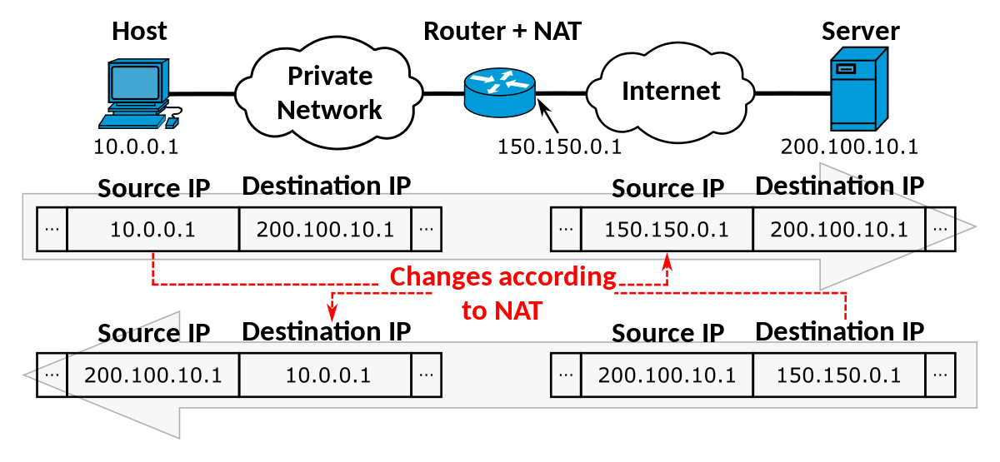

# NAT

La traducción de direcciones de red, también llamado enmascaramiento de IP o [NAT](https://es.wikipedia.org/wiki/Traducci%C3%B3n_de_direcciones_de_red)
(del inglés Network Address Translation), Consiste en convertir, en tiempo real, las direcciones utilizadas en los paquetes transportados. 

Es un mecanismo utilizado por los enrutadores para enmascarar la direccion de origen y cambiar la cabecera IP en los paquetes salientes.

## Funcionamiento
Todos los paquetes de Internet tienen una cabecera que incluye una dirección IP de origen y una dirección IP de destino.

* Los paquetes que pasan de la red privada a la red pública tendrán su dirección de origen modificada y compatible con la red publica.
* Los paquetes que pasan a la red pública de regreso a la red privada tendrán su dirección de destino modificada y compatible con la red publica.

